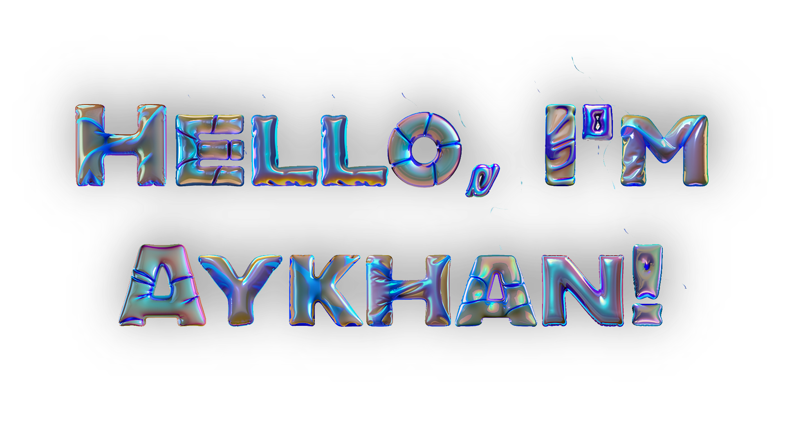

# AYKHAN SALUTES YOU ✌️

 

I'm a passionate FrontEnd developer from Azerbaijan 🇦🇿

|  |  |
| ------------- | ------------- |

I am a software engineer that is most skilled and passionate about JavaScript, Node and React.
I also have experience with tools like Next.js, Redux, Express, Webpack.
I developed the client side of an omnichannel CRM app with 10000+ users from 500+ companies in 16 countries.

### How to reach me

### Languages and tools

  
  
  
  
  
  
  
  
  
  
  
  
  
  
  
  
  
  
  
  
  
  
  
  
  

